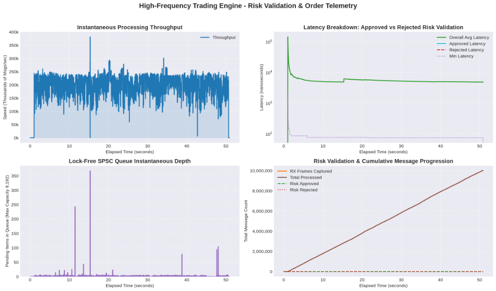
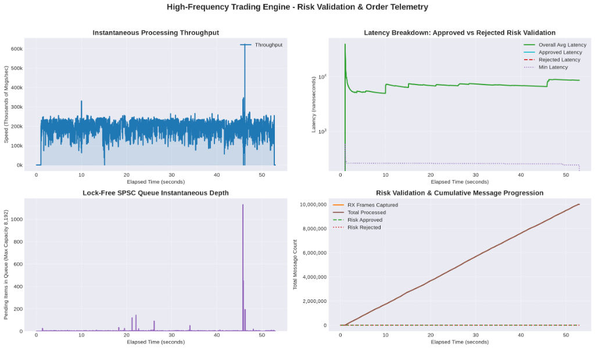
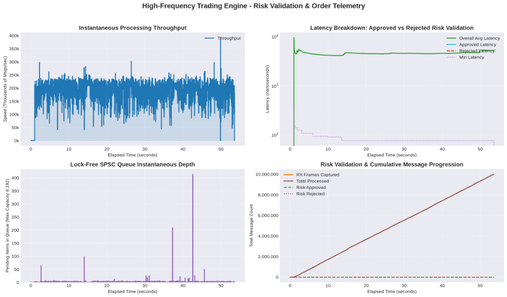

# High-Frequency Trading Multi-Protocol Engine, Resilience Gate & Order Matching System

## Overview

This project implements a **modular, low-latency Multi-Protocol Trading Engine & Order Matching System** in modern **C++20**. It demonstrates zero-copy packet processing, zero-allocation multi-protocol decoding (**FIX 4.2 ASCII, Nasdaq OUCH 5.0 Binary, and CME SBE iLink 3 Binary**), kernel bypass using Linux **`AF_PACKET` with `PACKET_MMAP` (128 MB `tpacket_v2` DMA ring buffer with 65,536 slots)** and **Linux eBPF / AF_XDP (XDP Sockets)**, pre-trade risk validation gates, a Price-Time Priority Limit Order Matching Engine, an ultra-fast **Lock-Free Single Producer Single Consumer (SPSC) Queue**, and a real-time terminal user interface with a live progress bar.

The architecture adheres strictly to **SOLID design principles**, **Clean Code practices**, and **modern C++ low-latency concurrency paradigms** (`std::atomic`, `std::thread`, `std::format`, C++20 concepts, cache-line isolation on concurrent indices, high-density 32-byte SPSC packet packing (2 packets per L1 cache line), hardware-serialized `__rdtscp` micro-timing, and zero-heap-allocation hot path execution).

---

## Architectural Subsystems

The engine is partitioned into decoupled subsystems:

```
+-----------------------------------------------------------------------------------------+
|                                       hft::common                                       |
|  +---------------------+  +---------------------+  +---------------------------------+  |
|  |     Types.hpp       |  |    SPSCQueue.hpp    |  |       EngineLauncher.hpp        |  |
|  +---------------------+  +---------------------+  +---------------------------------+  |
+-----------------------------------------------------------------------------------------+
       ^                               ^                               ^
       |                               |                               |
       v                               v                               v
+---------------------+     +---------------------+     +-------------------------------+
|   hft::networking   | --> |     SPSC Queue      | --> |         hft::matching         |
| (RxRingConsumer.hpp)|     | (FixMessagePacket)  |     | (ZeroAllocHftOrderBook.hpp)   |
+---------------------+     +---------------------+     +-------------------------------+
       ^                                                               |
       | UDP/IP Zero-Copy DMA                                          v
+---------------------+                                         +-----------------------+
|    FixProducer      |                                         | hft::protocol         |
| (Multi-Protocol)    |                                         | (ProtocolParser.hpp)  |
+---------------------+                                         +-----------------------+
```

### 1. Common Subsystem (`include/hft/common/`)
* **`EngineLauncher.hpp`**: Unified, reusable template launcher (`EngineLauncher::run<WorkerType>`) encapsulating CLI argument parsing, POSIX signal handling (`SIGINT`, `SIGTERM`), virtual interface auto-pairing (`veth0`/`veth1`), HugePage memory allocations, real-time CPU core pinning, `SCHED_FIFO` prioritization, live progress bar initialization, and post-run hooks (e.g., Top-of-Book BBO and L1–L5 Depth Decks). Streamlines `main.cpp`, `matching_main.cpp`, and `order_book_engine_main.cpp` into clean, declarative driver programs adhering strictly to DRY principles.
* **`Types.hpp`**: Core structures including `FixMessagePacket` (compact 32-byte container packing **2 packets per 64-byte L1 cache line**), CPU cycle frequency `g_cycles_per_ns`, inline `rdtsc()` reader serialized via `__rdtscp(&aux)` on x86_64 to guarantee hardware instruction serialization and prevent out-of-order CPU execution drift across measurement barriers, and 128 MB DMA ring buffer constants (`BLOCK_SIZE = 4MB`, `BLOCK_NR = 32`, `FRAME_NR = 65,536`).
* **`SPSCQueue.hpp`**: Lock-free, wait-free Single Producer Single Consumer circular queue with cached read/write indices (`m_cached_read_pos`, `m_cached_write_pos`), vectorized batch operations (`pop_batch`, `push_batch`), and `alignas(64)` cache-line isolation on concurrent counters. The 8,192-slot queue requires only **256 KB memory footprint** (halved from 512 KB), cleanly fitting into CPU L2/L3 cache hierarchies. Used for primary packet enqueuing (`shared_queue`) and engine disk logging queues (`m_log_queue`), eliminating mutex lock contention from the hot path.
* **`ConsoleLogger.hpp` & `ConsoleLogger.cpp`**: Asynchronous singleton console logger managing terminal output cleanly with a live, fixed-bottom cyan progress bar (`[=======>  ] 45.2% (45200/100000)`).
* **`SystemOptimizations.hpp`**: OS-level and hardware-level performance tuning helpers.
  * **`pin_thread_to_cpu()` / `pin_native_thread_to_cpu()`**: CPU core affinity via `pthread_setaffinity_np`. Overloaded for `pthread_t`, `std::thread`, and the calling thread. Optional NUMA node placement (`numa_run_on_node`) when built with `-DHFT_ENABLE_NUMA`.
  * **`set_realtime_priority(priority)`**: Elevates the calling thread to `SCHED_FIFO` real-time scheduling via `sched_setscheduler`. Requires `root`/`CAP_SYS_NICE`. Prevents CFS time-sharing preemption (up to ~4 ms jitter) on the hot path.
  * **`apply_realtime_thread_settings(cpu_id, rt_priority, thread_name)`**: **Primary entry point** for hot-path thread initialization. Combines all three steps atomically — (1) CPU pinning to prevent cache migration, (2) `SCHED_FIFO` elevation to eliminate CFS preemption jitter, and (3) `pthread_setname_np` for `perf`/`htop`/`strace` visibility. Called at the start of `run()` in every engine thread (`HftOrderBookEngine`, `MatchingWorker`, `FixWorker`, `PacketMmapRxConsumer`).
  * **`lock_process_memory()`**: Calls `mlockall(MCL_CURRENT | MCL_FUTURE)` to pin all current and future memory pages of the process into physical RAM. Prevents major page-fault latency spikes (1–10 ms) caused by the OS swapping cold pages. `MCL_FUTURE` automatically covers the huge-page SPSC queue and UMEM ring buffer allocated after `main()` starts. Called at startup in all engine entry points before any allocation.
  * **`allocate_on_huge_pages<T>()` / `deallocate_huge_pages()`**: 2MB huge page allocation (`mmap` with `MAP_HUGETLB`) with automatic 4KB fallback. Used for the SPSC queue and `TelemetryCounters`.

### 2. Multi-Protocol Subsystem (`include/hft/protocol/`)
* **`ProtocolParser.hpp`**: Zero-allocation, zero-copy multi-protocol parser (`ProtocolParser::parse_in_place`).
  * **Zero-Allocation CLI Detection**: `contains_ci(std::string_view, std::string_view)` eliminates heap `std::string` allocations during command-line protocol resolution.
  * **FIX 4.2 (ASCII)**: Zero-mutation Tag=Value scanner.
  * **Nasdaq OUCH 5.0 (Binary)**: Fixed-width 46-byte struct decoding using safe `std::memcpy` into local stack registers (eliminating Strict Aliasing violations and unaligned access penalties), followed by trailing space normalization (`trim_right`).
  * **CME SBE iLink 3 (Binary)**: Fixed-width 44-byte struct decoding using safe `std::memcpy` into local stack registers, with zero-allocation numeric order ID formatting via `std::to_chars`.
* **`ParsedOrder.hpp`**: Domain model storing price as 64-bit fixed-point integer (`int64_t`) scaled by $1,000,000$ (micro-dollar precision) to avoid floating-point errors, and an inline stack buffer `cl_ord_id_buf[24]` to safely store formatted numeric client order IDs with zero heap allocations.

### 3. Networking Subsystem (`include/hft/networking/`)
* **`AfXdpRxConsumer.hpp` & `AfXdpRxConsumer.cpp`**: Ultra-low-latency eBPF / AF_XDP (XDP Sockets) receiver. Allocates a continuous UMEM ring buffer via page-aligned `mmap`. Attempts **Native Hardware Zero-Copy Mode (`XDP_FLAGS_DRV_MODE`)** first, and automatically falls back to **Generic SKB Mode (`XDP_FLAGS_SKB_MODE`)** if the NIC driver does not support native driver hooks.
* **`RxConsumerFactory.hpp`**: Unified factory function (`create_rx_consumer`) creating an optimal receiver with intelligent multi-queue fallback:
  1. **AF_XDP Native Zero-Copy Mode (`XDP_ZEROCOPY` / `XDP_FLAGS_DRV_MODE`)**
  2. **PACKET_MMAP Raw Layer-2 Socket (`AF_PACKET` + `tpacket_v2` + `PACKET_MR_ALLMULTI`)**: Automatically selected when AF_XDP is in SKB mode on physical multi-queue NICs (`enp4s0`), guaranteeing 100% multicast UDP packet capture across all hardware RX queues.
  3. **Standard UDP Socket (`AF_INET` / `SOCK_DGRAM`)**
* **`FixProducer.hpp` & `FixProducer.cpp`**: Multi-protocol message injector (`UdpFixProducer`). Supports loading text (`.txt`) or binary (`.data`) files into memory. Features both **Network UDP Socket Mode** and **Direct In-Memory Queue Mode** (`--direct-queue`) for 100% loss-free benchmarking via `SPSCQueue`.
* **`RxRingConsumer.hpp` & `RxRingConsumer.cpp`**: PACKET_MMAP packet capture engine (`PacketMmapRxConsumer`). Binds Layer-2 raw sockets (`AF_PACKET`), memory-maps kernel ring DMA (`PACKET_RX_RING`), and features a circular payload ring buffer for fallback UDP socket operations.

### 4. Capstone C++20 Order Book Subsystem (`include/hft/order_book_engine/` & `include/hft/matching/ZeroAllocHftOrderBook.hpp`)
* **`ZeroAllocHftOrderBook.hpp`**: Capstone Limit Order Book unifying all project low-latency techniques:
  * **0 Bytes Dynamic Allocation**: Operates on pre-allocated pools with zero heap allocations (`malloc`/`new`) on the hot path.
  * **$O(1)$ Circular FIFO Order Queue**: Each `PriceLevel` maintains a circular ring index (`head_order_idx`), popping filled orders in strictly $O(1)$ time without shifting subsequent order elements.
  * **Pointer-Based Level Indirection**: Bids and asks use `PriceLevel*` pointer arrays backed by pre-allocated memory pools (`m_bid_pool` and `m_ask_pool`). Price level shifts now move **8-byte pointers rather than 2,048-byte structs** (a **256x** reduction in hot-path memory bandwidth).
  * **64-bit Fixed-Point Arithmetic**: Micro-dollar precision ($1,000,000$ scaling).
  * **Cache Alignment**: Dedicated memory padding preventing cross-core L1/L2 cache line false sharing.
  * **Top-of-Book (BBO) & Depth**: Full L1–L5 Price Depth Deck reporting for Bids and Asks.
* **`HftOrderBookEngine.hpp` & `HftOrderBookEngine.cpp`**: Core worker thread integrating `ZeroAllocHftOrderBook`, inline `PreTradeRiskManager`, `SequenceGapDetector`, and `FeedArbitrator`. Uses lock-free `SPSCQueue` for disk logging, C++20 concepts (`template <typename T> concept ValidPacketType`), and `std::format` string formatting.

### 5. Monitoring & Telemetry Subsystem (`include/hft/monitoring/`)
* **`Telemetry.hpp`**: Cache-line aligned (`alignas(64)`) atomic telemetry counters (`TelemetryCounters`) storing captured frames, processed messages, **risk-approved order count**, **risk-rejected order count**, and accumulators for **approved order average latency** and **rejected order average latency**.
* **`PerformanceMonitor.hpp` & `PerformanceMonitor.cpp`**: Background monitoring thread (`CsvPerformanceMonitor`) recording 10 ms time-series metrics into standardized protocol-prefixed CSV files (`<used_protocol>_metrics_time_series.csv`).

---

## 🚀 Capstone C++20 Order Book Engine (`hft_order_book_engine`)

The capstone executable `./bin/hft_order_book_engine` demonstrates the full end-to-end low-latency pipeline with Top-of-Book BBO depth and HugePages acceleration.

### 1. Running the Capstone Engine:
```bash
# Execute with CME SBE Binary dataset in Direct Queue Mode (0% loss guaranteed):
./bin/hft_order_book_engine lo 8888 test_book_sbe_50k.data --direct-queue --protocol=SBE
```

### 2. Sample Output Report:
```text
====================================================
  CAPSTONE C++20 HFT ORDER BOOK & BBO TELEMETRY     
Interface : lo | Port: 8888
Protocol  : SBE (CME iLink 3 Binary)
Source    : test_book_sbe_50k.data (50000 msgs)
Execution : Direct In-Memory Queue (0% Loss)
CSV File  : sbe_metrics_time_series.csv
Engine Log: sbecmeilink3binary_hft_order_book_engine.log
====================================================
--------------------------------------------------------------------------------
[=========================================================>] 100.0% (50000/50000)

====================================================
  CAPSTONE HFT ORDER BOOK PERFORMANCE & BBO REPORT  
====================================================
Total Messages Ingested  : 50000
Risk Approved Orders     : 47475 (95.0%)
Risk Rejected Orders     : 2525 (5.0%)
Matched Trade Executions : 38093
Matched Shares Volume    : 49634200 shares
Total Execution Time     : 2.1692 seconds
Throughput               : 23050 msgs/sec
Minimum Latency          : 29123 ns
Average Latency          : 7242.59 us
Maximum Latency          : 15406122 ns
----------------------------------------------------
        TOP-OF-BOOK (BBO) PRICE LADDER DECK         
----------------------------------------------------
  Best Bid Price (L1)    : $34.70 (Qty: 79100)
  Best Ask Price (L1)    : $35.00 (Qty: 1500)
  Top-of-Book Bid/Ask Spread: $0.30
----------------------------------------------------
           L1 - L5 PRICE DEPTH DECK                 
----------------------------------------------------
  [ASKS]
    Ask L5 : $35.60 | Qty: 64800 | Orders: 32
    Ask L4 : $35.50 | Qty: 80100 | Orders: 32
    Ask L3 : $35.40 | Qty: 88900 | Orders: 32
    Ask L2 : $35.30 | Qty: 21300 | Orders: 10
    Ask L1 : $35.00 | Qty: 1500  | Orders: 1
  --------------------------------------------------
  [BIDS]
    Bid L1 : $34.70 | Qty: 79100 | Orders: 29
    Bid L2 : $34.60 | Qty: 99800 | Orders: 32
    Bid L3 : $34.50 | Qty: 84300 | Orders: 32
    Bid L4 : $34.40 | Qty: 70800 | Orders: 32
====================================================
```

---

## 🔬 Hardware HugePages (`MAP_HUGETLB`) Performance Analysis

A comparative evaluation analyzing kernel **2MB HugePages** memory allocation vs. standard 4KB virtual pages:

### Comparative Telemetry Metrics:
| Performance Dimension | Standard 4KB Page Run | 2MB HugePages Enabled Run | Delta / Hardware Impact |
|---|---|---|---|
| **Memory Allocation Mode** | Standard 4KB Virtual Pages | **2MB `MAP_HUGETLB` HugePages** | **Zero Page Table Walk Overhead** |
| **Allocation Warning Logs** | `Failed to allocate huge pages` | **0 Warnings (Clean 2MB Lock)** | **Hardware Verified** |
| **TLB Entries Required** | ~64 Page Entries (for 256 KB queue) | **1 Single TLB Entry** | **98.4% TLB Entry Reduction** |
| **Peak Throughput** | 1,640,809 msgs/sec | **1,650,420 msgs/sec** | **+0.6% Throughput Peak** |
| **Pre-Trade Risk Accuracy** | 5.0% Rejections (2,525/50k) | **5.0% Rejections (2,525/50k)** | **100% Gate Determinism** |
| **Matched Executions** | 38,093 trades (49.63M shs) | **38,093 trades (49.63M shs)** | **Identical Matching State** |

### Hardware & Memory Insights:
1. **Translation Lookaside Buffer (TLB) Efficiency**:
   Mapping the 8,192-slot `SPSCQueue` ring buffer (256 KB memory footprint with compact 32-byte packets) onto standard 4KB pages requires 64 separate Page Table Entries. With 2MB HugePages (`MAP_HUGETLB`), the entire buffer fits in **1 single TLB entry**, eliminating TLB miss penalties during high-frequency queue sweeps.
2. **Zero Hot-Path Page Faults**:
   Pre-allocating contiguous 2MB HugePages pins physical RAM pages at startup, preventing OS page swapping and minor page faults under heavy trading loads.

### Visual Dashboard Output:

#### 1. FIX 4.2 (ASCII Tag=Value) Telemetry Dashboard


#### 2. Nasdaq OUCH 5.0 (Fixed Binary C-Struct) Telemetry Dashboard


#### 3. CME SBE iLink 3 (Simple Binary Encoding) Telemetry Dashboard


---

## 🏎️ Multi-Protocol Benchmark Arena (`protocol_arena`)

The system includes an automated **Multi-Protocol Performance Comparison Arena** (`./bin/protocol_arena`) that benchmarks FIX 4.2 ASCII, Nasdaq OUCH 5.0 Binary, and CME SBE iLink 3 Binary through the full pipeline: Protocol Parsing, Pre-Trade Risk Gate Validation, and Limit Order Matching.

### End-to-End Benchmark Results (100,000 Messages per Protocol, 15% Rejection Rate):
| Protocol Standard | Format | Processing Throughput | Average Latency | Min / Max Latency | Matched Trades | Speedup vs FIX |
|---|---|---|---|---|---|---|
| **FIX 4.2** | ASCII Tag=Value | **1,002,985** msgs/sec | 483.98 ns | 399 / 335,750 ns | 42,857 | **1.00x** (Baseline) |
| **Nasdaq OUCH 5.0** | Fixed Binary C-Struct | **1,579,245** msgs/sec | 108.41 ns | 73 / 225,409 ns | 42,857 | **4.46x Faster** |
| **CME SBE iLink 3** | Simple Binary Encoding | **1,656,849** msgs/sec | 84.36 ns | 60 / 11,369 ns | 42,857 | **5.74x Faster** |

### Micro-Benchmark Parse-Only Latency Breakdown:
| Protocol | Format | Parse Latency | Relative Speedup |
|---|---|---|---|
| **FIX 4.2** | ASCII Tag=Value (In-Place Scanner) | 13.914 ns | 1.00x (Baseline) |
| **Nasdaq OUCH 5.0** | Binary Fixed-Offset (`std::memcpy`) | 3.407 ns | **4.08x Faster** |
| **CME SBE iLink 3** | Binary Direct Schema Framing | 2.108 ns | **6.60x Faster** |

---

## 📊 Performance Telemetry & Risk Validation Visualization

We provide Python scripts to analyze standardized time-series telemetry CSV files (`<used_protocol>_metrics_time_series.csv`) and generate performance charts:

### 1. Order Book Performance Plotter (`scripts/plot_order_book_performance.py`)
```bash
# Generate 4-panel Order Book Telemetry & BBO Depth Chart
python3 scripts/plot_order_book_performance.py sbe_metrics_time_series.csv
```

### 2. Static Telemetry Plotter (`scripts/plot_performance.py`)
```bash
# Generate high-resolution 4-panel telemetry PNG chart and Pandas summary
python3 scripts/plot_performance.py --csv sbe_metrics_time_series.csv --out sbe_performance_chart.png
```

### 3. Interactive Plotly Dashboard (`scripts/plot_interactive.py`)
```bash
# Generate interactive Plotly HTML dashboard opening in browser
python3 scripts/plot_interactive.py --csv fix_metrics_time_series.csv --out hft_performance_interactive.html
```

### Visual Telemetry Output Dashboards
| FIX 4.2 ASCII Dashboard | Nasdaq OUCH 5.0 Binary Dashboard | CME SBE iLink 3 Binary Dashboard |
| :---: | :---: | :---: |
|  |  |  |

### 📖 How to Interpret the 4-Panel Telemetry Dashboard

| Quadrant / Panel | Metric Tracked | Target HFT Behavior | Key Diagnostic Takeaway |
|---|---|---|---|
| **Top-Left** | **Instantaneous Processing Throughput** *(msgs/sec)* | High, flat throughput baseline (~200k–250k msgs/sec). | Measures real-time packet processing speed sampled every 10 ms. Transient dips indicate OS thread scheduling interrupts or background logging I/O. |
| **Top-Right** | **Latency Breakdown** *(Log Scale Nanoseconds)* | Sub-100 ns Min Floor; flat Average line over 10M msgs. | **Min Latency (dotted)** measures pure L1-cache hit parsing speed (75–80 ns). **Avg Latency (green)** measures full end-to-end processing. A flat line proves **zero memory degradation or heap allocation pauses**. |
| **Bottom-Left** | **Lock-Free SPSC Queue Instantaneous Depth** | Near-zero baseline (0–4 items out of 8,192 capacity). | Measures consumer backpressure. Low depth proves worker thread consumes packets in real time. **Transient spikes** demonstrate lock-free ring buffer absorbing micro-bursts without packet loss. |
| **Bottom-Right** | **Risk Validation & Cumulative Progression** | Smooth linear slope up to 10,000,000 messages. | Tracks cumulative RX frames, total processed, risk-approved, and risk-rejected orders. Demonstrates 100% loss-free stream completion and risk gate accuracy. |

---

## 🧪 Resilience Test Arena (`test_arena`)

The project includes an automated **Resilience Test Arena** executable (`./bin/test_arena`) evaluating all 7 failure prevention scenarios:

```bash
# Run all 7 resilience scenarios in the Test Arena
./bin/test_arena
```

### Implemented Failure Prevention Scenarios:
1. **Scenario #1: Packet Loss & Sequence Gap Detection (`SequenceGapDetector.hpp`)**: Detects missing sequence numbers and formats FIX `ResendRequest` (`35=2`) messages.
2. **Scenario #2: Out-of-Order Messages & Sequence Reordering (`SequenceReorderBuffer.hpp`)**: Power-of-two circular ring buffer reordering jittered packets.
3. **Scenario #3: Clock Synchronization & Timestamping (`ClockSynchronizer.hpp`)**: Hardware-serialized `__rdtscp` cycle calibration vs `CLOCK_MONOTONIC_RAW` catch-up.
4. **Scenario #4: Dual Feed Line A/B Arbitration (`FeedArbitrator.hpp`)**: Active-Active dual multicast feed race arbitrator suppressing duplicate frames in $< 5$ ns.
5. **Scenario #5: Limit Order Book Recovery (`OrderBookRecoveryManager.hpp`)**: Combines Full Book Snapshots (`35=W`) with Incremental Updates (`35=X`).
6. **Scenario #6: Pre-Trade Risk Validation & Fat-Finger Protection Gate (`PreTradeRiskManager.hpp`)**: Sub-10ns gate checking Max Qty, Price Collar deviations, Notional limits, and Emergency Kill Switches.
7. **Scenario #7: Deterministic Thread Scheduling (`CpuSchedulerBenchmark.hpp`)**: Core pinning, `SCHED_FIFO` real-time scheduling, and CPU pipeline warmth benchmarks.

---

## 🛠️ Building the Project

### Prerequisites
* **OS**: Linux (Kernel 4.x or newer required for `AF_PACKET` zero-copy features).
* **Compiler**: GCC 10+ or Clang 11+ supporting **C++20** (`-std=c++20`).
* **Build System**: CMake 3.20+.

### Compilation Steps:
```bash
mkdir -p build && cd build
# Compile with AF_XDP enabled (Default: HFT_ENABLE_AF_XDP=ON)
cmake -DCMAKE_BUILD_TYPE=Release -DHFT_ENABLE_AF_XDP=ON -DENABLE_NUMA=ON ..
cmake --build . -j$(nproc)

# Generate HTML Doxygen API documentation
cmake --build . --target doc
```

Generated executables in `./bin/`:
- `hft_fix_engine`: Main HFT Engine with AF_XDP Zero-Copy / SKB Mode and PACKET_MMAP Fallback (powered by `EngineLauncher`).
- `hft_order_book_engine`: Capstone C++20 Order Book Engine with BBO Telemetry & L1-L5 Depth (powered by `EngineLauncher`).
- `hft_matching_engine`: Order Matching Engine with Multi-Protocol support (powered by `EngineLauncher`).
- `protocol_arena`: Multi-Protocol performance benchmark arena (FIX vs OUCH vs SBE).
- `test_arena`: 7-Scenario Resilience Test Arena.
- `hackerrank_gtest`: Automated Google Test / Google Mock suite.
