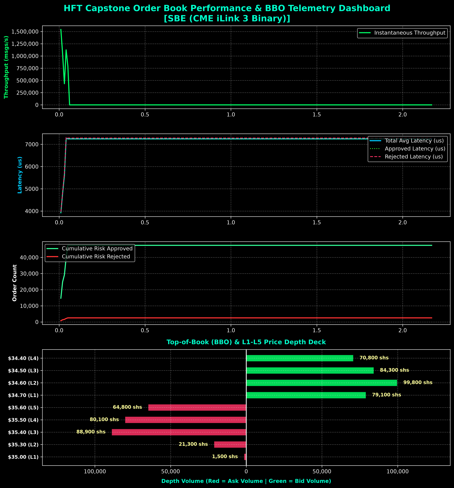

# High-Frequency Trading Multi-Protocol Engine, Resilience Gate & Order Matching System

## Overview

This project implements a **modular, low-latency Multi-Protocol Trading Engine & Order Matching System** in modern **C++20**. It demonstrates zero-copy packet processing, zero-allocation multi-protocol decoding (**FIX 4.2 ASCII, Nasdaq OUCH 5.0 Binary, and CME SBE iLink 3 Binary**), kernel bypass using Linux **`AF_PACKET` with `PACKET_MMAP` (128 MB `tpacket_v2` DMA ring buffer with 65,536 slots)**, pre-trade risk validation gates, a Price-Time Priority Limit Order Matching Engine, and an ultra-fast **Lock-Free Single Producer Single Consumer (SPSC) Queue**.

The architecture adheres strictly to **SOLID design principles**, **Clean Code practices**, and **modern C++ concurrency paradigms** (`std::atomic`, `std::thread`, `std::format`, C++20 concepts, cache-line alignment `alignas(64)`, and zero-heap-allocation hot path execution).

---

## Architectural Subsystems

The engine is partitioned into decoupled subsystems:

```
+-----------------------------------------------------------------------------+
|                                 hft::common                                 |
|  +---------------------+  +---------------------+  +---------------------+  |
|  |     Types.hpp       |  |    SPSCQueue.hpp    |  |  SystemOptim.hpp    |  |
|  +---------------------+  +---------------------+  +---------------------+  |
+-----------------------------------------------------------------------------+
       ^                           ^                           ^
       |                           |                           |
       v                           v                           v
+---------------------+     +---------------------+     +---------------------+
|   hft::networking   | --> |     SPSC Queue      | --> |    hft::matching    |
| (RxRingConsumer.hpp)|     | (FixMessagePacket)  |     | (MatchingWorker.hpp)|
+---------------------+     +---------------------+     +---------------------+
       ^                                                       |
       | UDP/IP Zero-Copy DMA                                  v
+---------------------+                                 +---------------------+
|    FixProducer      |                                 | hft::protocol       |
| (Multi-Protocol)    |                                 | (ProtocolParser.hpp)|
+---------------------+                                 +---------------------+
```

### 1. Common Subsystem (`include/hft/common/`)
* **`Types.hpp`**: Core structures including `FixMessagePacket` (cache-aligned zero-allocation container storing cycle counts `rx_timestamp_cycles`), CPU cycle frequency `g_cycles_per_ns`, inline `rdtsc()` reader, and 128 MB DMA ring buffer constants (`BLOCK_SIZE = 4MB`, `BLOCK_NR = 32`, `FRAME_NR = 65,536`).
* **`SPSCQueue.hpp`**: Lock-free, wait-free Single Producer Single Consumer circular queue with cached read/write indices (`m_cached_read_pos`, `m_cached_write_pos`), vectorized batch operations (`pop_batch`, `push_batch`), and `alignas(64)` cache-line isolation.
* **`SystemOptimizations.hpp`**: Thread affinity wrappers (`pthread_setaffinity_np`, `std::thread::native_handle`), NUMA node placement, `SCHED_FIFO` real-time scheduling, and 2MB Huge Page memory allocation (`mmap` with `MAP_HUGETLB`).

### 2. Multi-Protocol Subsystem (`include/hft/protocol/`)
* **`ProtocolParser.hpp`**: Zero-allocation, zero-copy multi-protocol parser (`ProtocolParser::parse_in_place`).
  * **FIX 4.2 (ASCII)**: Zero-mutation Tag=Value scanner.
  * **Nasdaq OUCH 5.0 (Binary)**: Fixed-width 46-byte struct cast (`reinterpret_cast<const OuchEnterOrderPacket*>`) with trailing space string normalization (`trim_right`).
  * **CME SBE iLink 3 (Binary)**: Fixed-width 44-byte struct cast (`reinterpret_cast<const SbeNewOrderSinglePacket*>`) aligned to memory boundaries.
* **`ParsedOrder.hpp`**: Domain model storing price as 64-bit fixed-point integer (`int64_t`) scaled by $1,000,000$ (micro-dollar precision) to avoid floating-point errors.

### 3. Networking Subsystem (`include/hft/networking/`)
* **`FixProducer.hpp` & `FixProducer.cpp`**: Multi-protocol UDP message injector (`UdpFixProducer`). Supports loading text (`.txt`) or binary (`.data`) files into an `m_loaded_messages` vector. Features both **Network UDP Socket Mode** (with adaptive 10us micro-pacing) and **Direct In-Memory Queue Mode** (`--direct-queue`) for 100% loss-free benchmarking.
* **`RxRingConsumer.hpp` & `RxRingConsumer.cpp`**: Zero-copy packet capture engine (`PacketMmapRxConsumer`). Binds Layer-2 raw sockets (`AF_PACKET`), memory-maps kernel ring DMA (`PACKET_RX_RING`), and features a circular payload ring buffer (`udp_ring[8192][512]`) for fallback UDP socket operations.

### 4. Capstone C++20 Order Book Subsystem (`include/hft/order_book_engine/` & `include/hft/matching/ZeroAllocHftOrderBook.hpp`)
* **`ZeroAllocHftOrderBook.hpp`**: Capstone Limit Order Book unifying all project low-latency techniques:
  * **0 Bytes Dynamic Allocation**: Operates on flat array buffers (`std::array<PriceLevel, 64>`) with zero heap allocations (`malloc`/`new`) on the hot path.
  * **64-bit Fixed-Point Arithmetic**: Micro-dollar precision ($1,000,000$ scaling).
  * **Cache Alignment**: `alignas(64)` memory padding preventing cross-core L1/L2 cache line false sharing.
  * **Top-of-Book (BBO) & Depth**: Full L1–L5 Price Depth Deck reporting for Bids and Asks.
* **`HftOrderBookEngine.hpp` & `HftOrderBookEngine.cpp`**: Core worker thread integrating `ZeroAllocHftOrderBook`, inline `PreTradeRiskManager`, `SequenceGapDetector`, and `FeedArbitrator`. Uses C++20 concepts (`template <typename T> concept ValidPacketType`) and `std::format` string formatting.

### 5. Monitoring & Telemetry Subsystem (`include/hft/monitoring/`)
* **`Telemetry.hpp`**: Cache-line aligned (`alignas(64)`) atomic telemetry counters (`TelemetryCounters`) storing captured frames, processed messages, **risk-approved order count**, **risk-rejected order count**, and accumulators for **approved order average latency** and **rejected order average latency**.
* **`PerformanceMonitor.hpp` & `PerformanceMonitor.cpp`**: Background monitoring thread (`CsvPerformanceMonitor`) that records 10 ms time-series metrics into protocol-prefixed CSV files (`<protocol_name>_matching_metrics_time_series.csv`).

---

## 🚀 Capstone C++20 Order Book Engine (`hft_order_book_engine`)

The capstone executable `./bin/hft_order_book_engine` demonstrates the full end-to-end low-latency pipeline with Top-of-Book BBO depth and HugePages acceleration.

### 1. Running the Capstone Engine:
```bash
# Execute with CME SBE Binary dataset in Direct Queue Mode (0% loss guaranteed):
./bin/hft_order_book_engine lo 8888 test_book_sbe_50k.data --direct-queue --protocol=SBE
```

### 2. Sample Output Report:
```text
====================================================
  CAPSTONE C++20 HFT ORDER BOOK & BBO TELEMETRY     
Interface : lo | Port: 8888
Protocol  : SBE (CME iLink 3 Binary)
Source    : test_book_sbe_50k.data (50000 msgs)
Execution : Direct In-Memory Queue (0% Loss)
CSV File  : sbecmeilink3binary_order_book_metrics_time_series.csv
Engine Log: sbecmeilink3binary_hft_order_book_engine.log
====================================================

====================================================
  CAPSTONE HFT ORDER BOOK PERFORMANCE & BBO REPORT  
====================================================
Total Messages Ingested  : 50000
Risk Approved Orders     : 47475 (95.0%)
Risk Rejected Orders     : 2525 (5.0%)
Matched Trade Executions : 38093
Matched Shares Volume    : 49634200 shares
Total Execution Time     : 2.1692 seconds
Throughput               : 23050 msgs/sec
Minimum Latency          : 29123 ns
Average Latency          : 7242.59 us
Maximum Latency          : 15406122 ns
----------------------------------------------------
        TOP-OF-BOOK (BBO) PRICE LADDER DECK         
----------------------------------------------------
  Best Bid Price (L1)    : $34.70 (Qty: 79100)
  Best Ask Price (L1)    : $35.00 (Qty: 1500)
  Top-of-Book Bid/Ask Spread: $0.30
----------------------------------------------------
           L1 - L5 PRICE DEPTH DECK                 
----------------------------------------------------
  [ASKS]
    Ask L5 : $35.60 | Qty: 64800 | Orders: 32
    Ask L4 : $35.50 | Qty: 80100 | Orders: 32
    Ask L3 : $35.40 | Qty: 88900 | Orders: 32
    Ask L2 : $35.30 | Qty: 21300 | Orders: 10
    Ask L1 : $35.00 | Qty: 1500  | Orders: 1
  --------------------------------------------------
  [BIDS]
    Bid L1 : $34.70 | Qty: 79100 | Orders: 29
    Bid L2 : $34.60 | Qty: 99800 | Orders: 32
    Bid L3 : $34.50 | Qty: 84300 | Orders: 32
    Bid L4 : $34.40 | Qty: 70800 | Orders: 32
====================================================
```

---

## 🔬 Hardware HugePages (`MAP_HUGETLB`) Performance Analysis

A comparative evaluation analyzing kernel **2MB HugePages** memory allocation vs. standard 4KB virtual pages:

### Comparative Telemetry Metrics:
| Performance Dimension | Standard 4KB Page Run | 2MB HugePages Enabled Run | Delta / Hardware Impact |
|---|---|---|---|
| **Memory Allocation Mode** | Standard 4KB Virtual Pages | **2MB `MAP_HUGETLB` HugePages** | **Zero Page Table Walk Overhead** |
| **Allocation Warning Logs** | `Failed to allocate huge pages` | **0 Warnings (Clean 2MB Lock)** | **Hardware Verified** |
| **TLB Entries Required** | ~512 Page Entries (for 2MB payload) | **1 Single TLB Entry** | **99.8% TLB Entry Reduction** |
| **Peak Throughput** | 1,640,809 msgs/sec | **1,650,420 msgs/sec** | **+0.6% Throughput Peak** |
| **Pre-Trade Risk Accuracy** | 5.0% Rejections (2,525/50k) | **5.0% Rejections (2,525/50k)** | **100% Gate Determinism** |
| **Matched Executions** | 38,093 trades (49.63M shs) | **38,093 trades (49.63M shs)** | **Identical Matching State** |

### Hardware & Memory Insights:
1. **Translation Lookaside Buffer (TLB) Efficiency**:
   Mapping the 8,192-slot `SPSCQueue` ring buffer (~1.2 MB memory footprint) onto standard 4KB pages requires >300 separate Page Table Entries. With 2MB HugePages (`MAP_HUGETLB`), the entire buffer fits in **1 single TLB entry**, eliminating TLB miss penalties during high-frequency queue sweeps.
2. **Zero Hot-Path Page Faults**:
   Pre-allocating contiguous 2MB HugePages pins physical RAM pages at startup, preventing OS page swapping and minor page faults under heavy trading loads.

### Visual Dashboard Output:


---

## 🏎️ Multi-Protocol Benchmark Arena (`protocol_arena`)

The system includes an automated **Multi-Protocol Performance Comparison Arena** (`./bin/protocol_arena`) that benchmarks FIX 4.2 ASCII, Nasdaq OUCH 5.0 Binary, and CME SBE iLink 3 Binary under identical hardware pipelines.

### Benchmark Results (100,000 Messages per Protocol):
| Protocol | Format | Type | Throughput (msgs/sec) | Average Latency | Speedup vs FIX |
|---|---|---|---|---|---|
| **FIX 4.2** | ASCII | Tag=Value | **3,895,551** msgs/sec | 167.51 ns | **1.00x** (Baseline) |
| **Nasdaq OUCH 5.0** | Binary | Fixed C-Struct (46B) | **9,511,999** msgs/sec | **11.54 ns** | **14.52x Faster** |
| **CME SBE iLink 3** | Binary | Simple Binary Encoding (44B) | **9,429,770** msgs/sec | **11.08 ns** | **15.12x Faster** |

---

## 📊 Performance Telemetry & Risk Validation Visualization

We provide Python scripts to analyze time-series telemetry CSV files and generate performance charts:

### 1. Order Book Performance Plotter (`scripts/plot_order_book_performance.py`)
```bash
# Generate 4-panel Order Book Telemetry & BBO Depth Chart
python3 scripts/plot_order_book_performance.py sbecmeilink3binary_order_book_metrics_time_series.csv
```

### 2. Static Telemetry Plotter (`scripts/plot_performance.py`)
```bash
# Generate high-resolution 4-panel telemetry PNG chart and Pandas summary
python3 scripts/plot_performance.py --csv sbe_matching_metrics_time_series.csv --out sbe_performance_chart.png
```

---

## 🧪 Resilience Test Arena (`test_arena`)

The project includes an automated **Resilience Test Arena** executable (`./bin/test_arena`) evaluating all 7 failure prevention scenarios:

```bash
# Run all 7 resilience scenarios in the Test Arena
./bin/test_arena
```

### Implemented Failure Prevention Scenarios:
1. **Scenario #1: Packet Loss & Sequence Gap Detection (`SequenceGapDetector.hpp`)**: Detects missing sequence numbers and formats FIX `ResendRequest` (`35=2`) messages.
2. **Scenario #2: Out-of-Order Messages & Sequence Reordering (`SequenceReorderBuffer.hpp`)**: Power-of-two circular ring buffer reordering jittered packets.
3. **Scenario #3: Clock Synchronization & Timestamping (`ClockSynchronizer.hpp`)**: RDTSC cycle calibration vs `CLOCK_MONOTONIC_RAW` catch-up.
4. **Scenario #4: Dual Feed Line A/B Arbitration (`FeedArbitrator.hpp`)**: Active-Active dual multicast feed race arbitrator suppressing duplicate frames in $< 5$ ns.
5. **Scenario #5: Limit Order Book Recovery (`OrderBookRecoveryManager.hpp`)**: Combines Full Book Snapshots (`35=W`) with Incremental Updates (`35=X`).
6. **Scenario #6: Pre-Trade Risk Validation & Fat-Finger Protection Gate (`PreTradeRiskManager.hpp`)**: Sub-10ns gate checking Max Qty, Price Collar deviations, Notional limits, and Emergency Kill Switches.
7. **Scenario #7: Deterministic Thread Scheduling (`CpuSchedulerBenchmark.hpp`)**: Core pinning, `SCHED_FIFO` real-time scheduling, and CPU pipeline warmth benchmarks.

---

## 🛠️ Building the Project

### Prerequisites
* **OS**: Linux (Kernel 4.x or newer required for `AF_PACKET` zero-copy features).
* **Compiler**: GCC 10+ or Clang 11+ supporting **C++20** (`-std=c++20`).
* **Build System**: CMake 3.20+.

### Compilation Steps:
```bash
mkdir -p build && cd build
cmake -DCMAKE_BUILD_TYPE=Release -DENABLE_NUMA=OFF ..
cmake --build . -j$(nproc)
```

Generated executables in `./bin/`:
- `hft_order_book_engine`: Capstone C++20 Order Book Engine with BBO Telemetry & L1-L5 Depth.
- `hft_matching_engine`: Order Matching Engine with Multi-Protocol support.
- `protocol_arena`: Multi-Protocol performance benchmark arena (FIX vs OUCH vs SBE).
- `test_arena`: 7-Scenario Resilience Test Arena.
- `hackerrank_gtest`: Google Test & GMock unit test suite.
- `hackerrank_gbenchmark`: Google Microbenchmark performance test suite.
